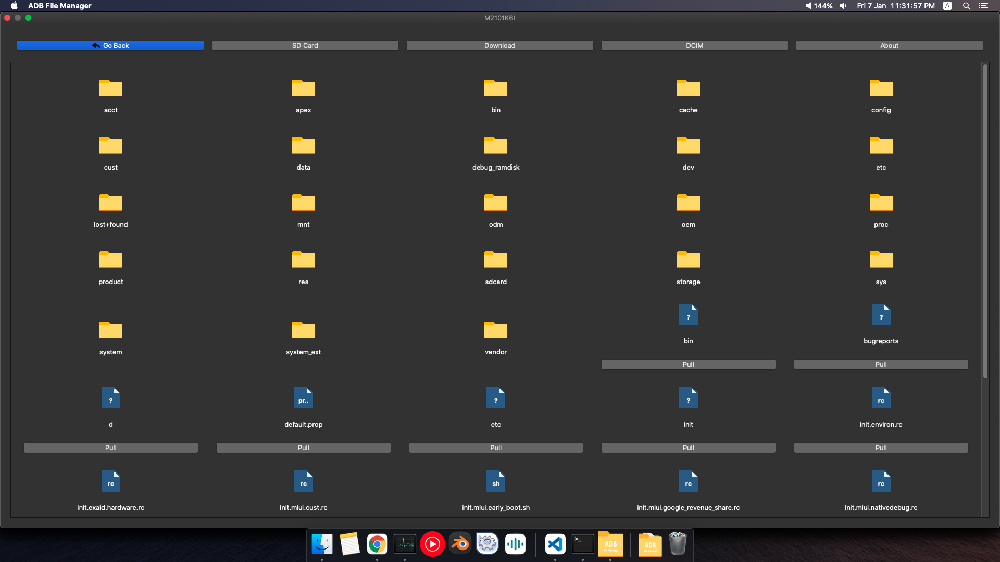
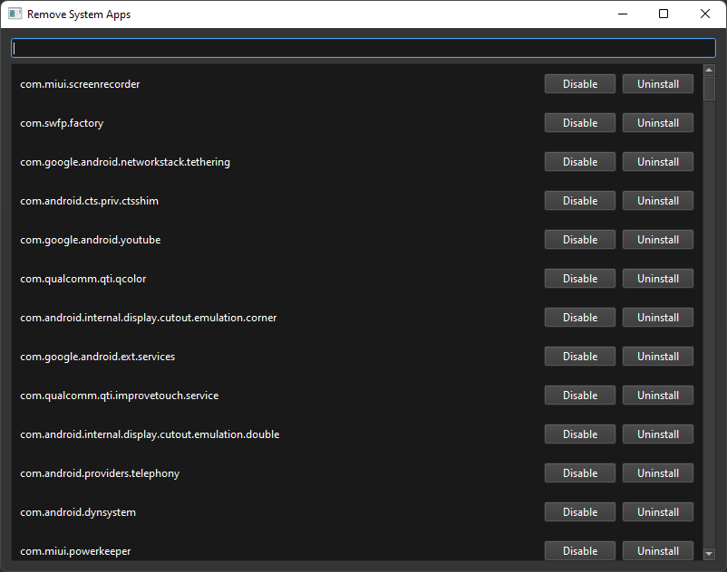

# adb-file-manager

<p>

</p>

Cross Platform Desktop app for android file transfer using adb

Features:
 - Push/Pull Files to your Android Device
 - Uninstall/Disable System apps

## Requirements

Make sure you [enabled adb debugging][enable-adb] on your device(s).

[enable-adb]: https://developer.android.com/studio/command-line/adb.html#Enabling

## Download

[](dist/ADB%20File%20Manager.exe?raw=1) [](dist/ADB%20File%20Manager%201.1.0%20-%20Linux?raw=1) [](dist/ADB%20File%20Manager%201.1.0%20Mac%20App%20File.zip?raw=1)


## Screenshots




## Run Locally

Clone the project

```bash
  git clone [adb-filemanager]
```

Go to the project directory

```bash
  cd adb-filemanager
```

Install requirements

```bash
  python install -r requirements.txt
```
Change the adb_path  in main.py to adb executable path
```bash
  adb_path="/usr/local/bin/adb"

```
Run

```bash
  python main.py
```


